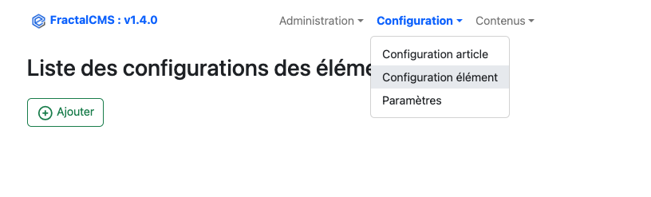
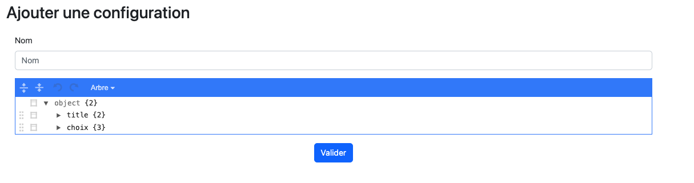
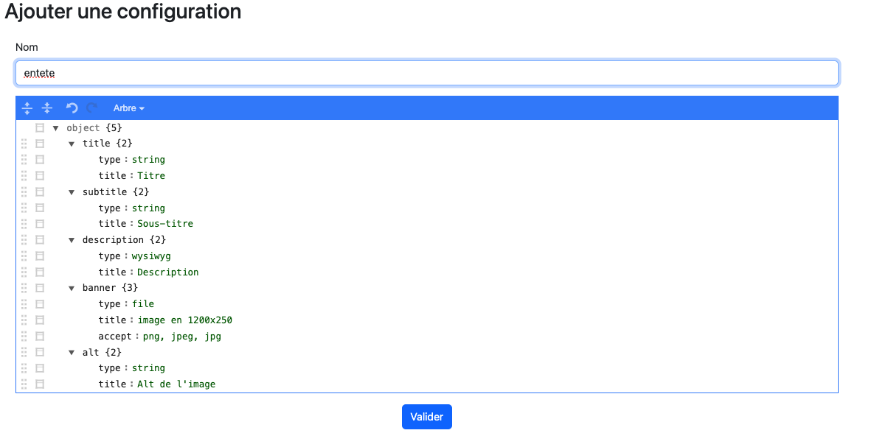
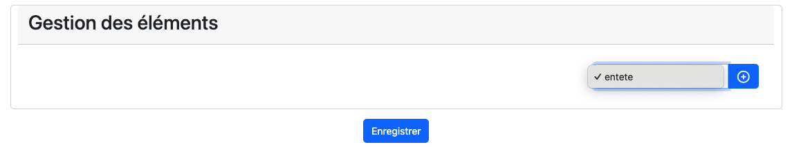
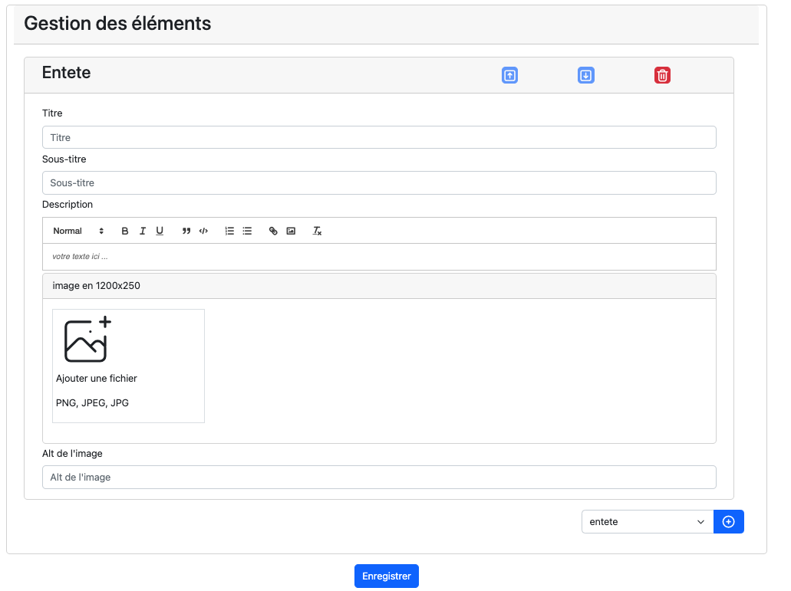
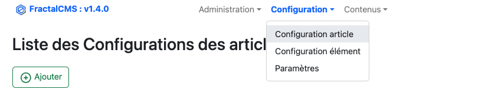
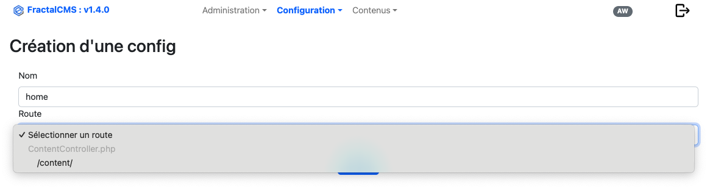
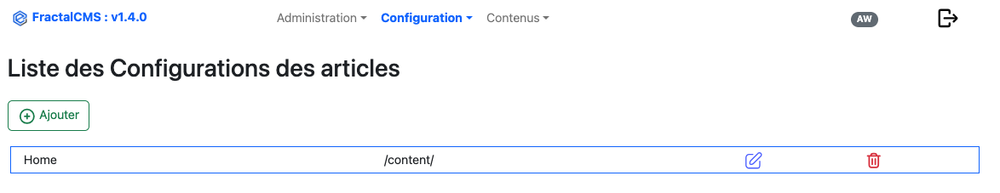

# Configuration

## Gestion de la configuration des éléménts

Tous les articles peuvent avoir des éléments. Ces éléments permettent de définir les informations
qui seront utilisées pour générer le HTML finale.

Chaque élément doit-être configuré avant de pouvoir être visible dans l'article.

### Interface



### Editer / Ajouter

Afin d'ajouter une nouvelle configuration d'un élément, il faut cliquer sur **Ajouter**.



* Nom : nom de la configuration, cette valeur doit-être unique
* Configuration Json : Ajout des attributs et leur définition qui sera utiliser pour générer
  le HTML de l'élément dans l'article et définir les attributs à utiliser voir [JsonEditor](https://github.com/josdejong/jsoneditor)

#### paramétrage d'un attribut

Chaque attribut doit comporter au moins ces paramètres pour être utilisable.

* Son nom : nom de l'objet intitulé de l'attribut dans model final
* Type : type de l'attribut
    * "**string**" : Champ input type text
    * "**text**" : Champ input type textarea
    * "**file**" : champ input type file
    * "**radio**" : champ input type radio
    * "**checkbox**" : champ input type checkbox
    * "**wysiwyg**" : champ input type text avec une interface _wysiwyg_ (https://quilljs.com/)
    * "**listcms**" : champ input dropdown list contenant les articles de FractalCMS ainsi que les _controller/action_
*
* Title : intitulé à afficher dans l'article

```json
{
  "title": {
      "type": "string",
      "title" : "Titre de la section"
  }
}
```

### Exemple réel

#### Création d'un élémént _entête_



```json
{
  "title": {
    "type": "string",
    "title": "Titre"
  },
  "subtitle": {
    "type": "string",
    "title": "Sous-titre"
  },
  "description": {
    "type": "wysiwyg",
    "title": "Description"
  },
  "banner": {
    "type": "file",
    "title": "image en 1200x250",
    "accept": "png, jpeg, jpg"
  },
  "alt": {
    "type": "string",
    "title": "Alt de l'image"
  }
}
```

#### Utilisation dans l'interface de mise à jour d'un article

**Choix et ajout de la configuration _entete_**



**Ajout de la l'élément dans l'article**



Désormais, l'élément peut-être configuré et enregistré. les informations pourront ête utilisées
sur le _front_.

#### Utilisation dans l'application

**Dans le controlleur**

```bash
 public function actionIndex()
    {
        try {
            Yii::debug('Trace :'.__METHOD__, __METHOD__);
            $content = $this->getContent();
            $itemEntete = $content->getItems()->andWhere(['configItemId' => Parameter::getParameter('ITEM', 'ENTETE')])->one();
            $itemsQuery = $content->getItems()->andWhere([
                'not', ['configItemId' => [
                    Parameter::getParameter('ITEM', 'ENTETE'),
                    ]]]);
            return $this->render('index',
                [
                    'content' => $content,
                    'entete' => $itemEntete,
                    ]);
        } catch (Exception $e) {
            Yii::error($e->getMessage(), __METHOD__);
            throw $e;
        }
    }

```

**Dans la vue (index)**

```bash
<?php
/**
 * main.php
 *
 * PHP Version 8.2+
 *
 * @version XXX
 * @package webapp\views\layouts
 *
 * @var $this yii\web\View
 * @var $content \fractalCms\content\content\models\Content
 * @var $entete \fractalCms\content\content\models\Item
 */
 
use fractalCms\content\content\helpers\Html;
use webapp\widgets\Breadcrumb;

$title = ($entete instanceof \fractalCms\content\content\models\Item) ? $entete->title : $content->name;
$subtitle = ($entete instanceof \fractalCms\content\content\models\Item) ? $entete->subtitle : null;
$banner = ($entete instanceof \fractalCms\content\content\models\Item) ? $entete->banner : null;
$description = ($entete instanceof \fractalCms\content\content\models\Item) ? $entete->description : null;

../..
```

## Gestion des types d'article

Le configuration du type d'élément faite partie des concepts important de FractalCMS. C'est grâce à cette configuration qu'un
article (Content) pourra être dirigé vers le bon **Controller** et la bonne  **Action** et permettre
ainsi de construire une vue adapté à vos besoin.

### Interface



### Principe

Dans votre application Yii, ajouté un **Controller** qui étant **fractalCms\content\content\controllers\CmsController**, dans lequel vous allez
créer l'action désirée ex :

```php
<?php

namespace webapp\controllers;

use fractalCms\content\content\controllers\CmsController;
use fractalCms\content\content\models\Content;
use Yii;
use Exception;

/**
 * ContentController class
 *
 * @author David Ghyse <dghyse@redcat.fr>
 * @version XXX
 * @package webapp\controllers
 * @since XXX
 */
class ContentController extends CmsController
{

    /**
     * @return \yii\web\Response|string
     * @since XXX
     */
    public function actionIndex()
    {
        try {
            Yii::debug('Trace :'.__METHOD__, __METHOD__);
            /** Content $content **/
            $content = $this->getContent();
            $itemsQuery = $content->getItems();
            return $this->render('index',
                [
                    'content' => $content,
                    'sections' => $sections
                    ]);
        } catch (Exception $e) {
            Yii::error($e->getMessage(), __METHOD__);
            throw $e;
        }
    }
}

?>
 ```

#### Ajout une configuration

Afin d'ajouter une configuration, il suffit de cliquer sur "Ajouter", le formulaire de création apparait.



A ce stade, nous voyons apparaitre la liste des types qui ont été ajoutés dans l'application.
Nous allons créé le type **home** que nous allons diriger vers le contrôleur **ContentController** et l'action **actionIndex**.

* ici : **\content\** dans la liste.

### Retour à la liste

Le type **home** est maintenant créé et est visible dans l'interface.



### Conclusion

Désormais, tout article ou section qui aura le type **home** sera dirigé vers l'action **actionIndex** du
contrôleur **ContentController**.

[<- Précédent](02-initialisation.md) | [Suivant ->](04-interface.md)